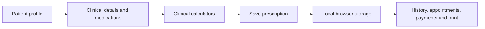

<h1 align="center">Prescription Writer BD</h1>

<p align="center">
  A React and TypeScript healthcare workflow prototype for drafting prescriptions, managing patient visits,
  performing clinical calculations, and configuring prescription-print layouts.
</p>

<p align="center">
  
  
  
</p>

---

## The problem

Clinical documentation and prescription preparation can require repeatedly entering patient demographics, examination findings, clinical history, medication details, follow-up information, and billing records. This prototype explores a single browser-based workspace that keeps these tasks together while providing a print-oriented prescription layout.

## The approach

The application uses a tabbed, client-side workflow. Patient and prescription information is held in typed React state, persisted locally in the browser, and reused across the relevant screens.

| # | Workflow step | What happens |
|---|---|---|
| 1 | **Patient selection** | Select an existing demo patient or start a new patient record with demographics, history, examination and diagnosis fields. |
| 2 | **Medication entry** | Search the local Bangladesh brand-index dataset, choose a medicine, and add dose, duration and food instructions to the prescription. |
| 3 | **Clinical calculations** | Calculate BMI, insulin-dose suggestions, BMR, paediatric growth-screening values and estimated delivery date (EDD) from entered patient data. |
| 4 | **Save visit** | Persist the active patient record locally; simulate a payment record and complete a linked appointment when applicable. |
| 5 | **Layout and print** | Configure header details and centimetre-based prescription-pad dimensions, preview the layout, then invoke the browser print dialog. |



## Tech stack

**Frontend** — React 19 · TypeScript · Vite · Tailwind CSS · Lucide React

**State and persistence** — React Hooks (`useState`, `useEffect`) · Browser `localStorage`

**Tooling and deployment** — npm · TypeScript compiler · GitHub Actions · GitHub Pages

## Repository layout

```
src/
  main.tsx                         application entry point; mounts React into index.html
  App.tsx                          primary workflow, state management and screen composition
  data.ts                          local seed data: medicines, patients, appointments and settings
  types.ts                         shared TypeScript interfaces for application data
  index.css                        global and print styles
  components/
    Calculators.tsx                BMI, insulin, BMR, Z-score and EDD calculators
    PageLayoutSimulator.tsx        prescription-pad dimension controls and visual preview
.github/workflows/deploy.yml       GitHub Pages build and deployment workflow
vite.config.ts                     Vite, React and Tailwind configuration
```

## Getting started

**Prerequisite:** Node.js 20 or newer.

```bash
npm install
npm run dev
```

Open the local address shown by Vite (normally `http://localhost:3000`).

Useful commands:

```bash
npm run lint     # TypeScript type check
npm run build    # Production build to dist/
npm run preview  # Preview the production build locally
```

## GitHub Pages deployment

The repository includes a GitHub Actions workflow at [`.github/workflows/deploy.yml`](.github/workflows/deploy.yml). After pushing the repository to GitHub:

1. Open **Settings → Pages** in the GitHub repository.
2. Under **Build and deployment**, choose **GitHub Actions** as the source.
3. Push to the `main` branch. The workflow builds the Vite app and deploys the generated `dist/` folder.

## Data, privacy and clinical-safety notice

This project is a student portfolio prototype, not a production clinical information system. It has no authentication, server-side database, encryption, audit trail, role-based access control, regulatory review, or clinical validation. Data is stored only in the current browser's `localStorage` and may be removed when browser storage is cleared. Never enter real patient-identifiable or clinical data into this prototype.

The calculator outputs and prescription-related content are demonstration features only and must not be used for clinical decision-making, diagnosis, treatment, or medication dosing.

## Status

Built as a front-end healthcare workflow prototype. Future work includes a secure backend, authentication, encrypted data storage, audit logging, validated clinical decision support, test coverage and accessibility review.
