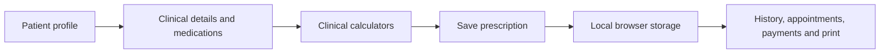

<h1 align="center">Prescription Writer BD</h1>

<p align="center">
  A React and TypeScript healthcare workflow prototype for drafting prescriptions, managing patient visits,
  performing clinical calculations, and configuring prescription-print layouts.
</p>

<p align="center">
  
  
  
</p>

---

## The problem

Clinical documentation and prescription preparation can require repeatedly entering patient demographics, examination findings, clinical history, medication details, follow-up information, and billing records. This prototype explores a single browser-based workspace that keeps these tasks together while providing a print-oriented prescription layout.

## The approach

The application uses a tabbed, client-side workflow. Patient and prescription information is held in typed React state, persisted locally in the browser, and reused across the relevant screens.

| # | Workflow step | What happens |
|---|---|---|
| 1 | **Patient selection** | Select an existing demo patient or start a new patient record with demographics, history, examination and diagnosis fields. |
| 2 | **Medication entry** | Search the local Bangladesh brand-index dataset, choose a medicine, and add dose, duration and food instructions to the prescription. |
| 3 | **Clinical calculations** | Calculate BMI, insulin-dose suggestions, BMR, paediatric growth-screening values and estimated delivery date (EDD) from entered patient data. |
| 4 | **Save visit** | Persist the active patient record locally; simulate a payment record and complete a linked appointment when applicable. |
| 5 | **Layout and print** | Configure header details and centimetre-based prescription-pad dimensions, preview the layout, then invoke the browser print dialog. |


```mermaid
graph LR
    A[Patient profile] --> B[Clinical details and medications]
    B --> C[Clinical calculators]
    C --> D[Save prescription]
    D --> E[Local browser storage]
    E --> F[History, appointments, payments and print]
```

## Tech stack

**Frontend** — React 19 · TypeScript · Vite · Tailwind CSS · Lucide React

**State and persistence** — React Hooks (`useState`, `useEffect`) · Browser `localStorage`

**Tooling and deployment** — npm · TypeScript compiler · GitHub Actions · GitHub Pages

## Repository layout

```
src/
  main.tsx                         application entry point; mounts React into index.html
  App.tsx                          primary workflow, state management and screen composition
  data.ts                          local seed data: medicines, patients, appointments and settings
  types.ts                         shared TypeScript interfaces for application data
  index.css                        global and print styles
  components/
    Calculators.tsx                BMI, insulin, BMR, Z-score and EDD calculators
    PageLayoutSimulator.tsx        prescription-pad dimension controls and visual preview
.github/workflows/deploy.yml       GitHub Pages build and deployment workflow
vite.config.ts                     Vite, React and Tailwind configuration
```

## Getting started

**Prerequisite:** Node.js 20 or newer.

```bash
npm install
npm run dev
```

Open the local address shown by Vite (normally `http://localhost:3000`).

Useful commands:

```bash
npm run lint     # TypeScript type check
npm run build    # Production build to dist/
npm run preview  # Preview the production build locally
```

## GitHub Pages deployment

The repository includes a GitHub Actions workflow at [`.github/workflows/deploy.yml`](.github/workflows/deploy.yml). After pushing the repository to GitHub:

1. Open **Settings → Pages** in the GitHub repository.
2. Under **Build and deployment**, choose **GitHub Actions** as the source.
3. Push to the `main` branch. The workflow builds the Vite app and deploys the generated `dist/` folder.

## Backend foundation (SQLite first)

The repository now includes a FastAPI foundation in `backend/app/` for the planned move from browser-only storage to a secure server-side application:

- SQLAlchemy models for users, patients, prescriptions, AI sessions and audit logs
- Doctor registration/login with bcrypt password hashing and JWT access tokens
- Protected, doctor-scoped patient CRUD endpoints
- SQLite by default, with `DATABASE_URL` ready to switch to PostgreSQL later

Create `backend/.env` from `backend/.env.example`, set a long unique `JWT_SECRET_KEY`, then install and run the backend:

```powershell
cd backend
python -m pip install -r requirements.txt
Copy-Item .env.example .env
python -m uvicorn main:app --reload --port 8000
```

The API documentation is then available at `http://localhost:8000/docs`. The current React workflow still uses browser storage; connecting its existing screens to these protected endpoints is the next migration step.

## AI Scribe local integration

The optional AI Scribe workflow is designed for audio-to-SOAP documentation drafting and an informational OpenFDA label lookup. The React review interface is present, but the `/api/visit-audio` route from the earlier prototype has not yet been migrated into the current authenticated FastAPI router structure.

```text
React app (port 3000) -> FastAPI AI Scribe API (port 8000) -> Gemini / OpenFDA
```

Start the API in a first terminal:

```powershell
cd backend
python -m pip install -r requirements.txt
Copy-Item .env.example .env
# Edit backend/.env and add GEMINI_API_KEY before continuing.
python -m uvicorn main:app --reload --port 8000
```

Start the React application in a second terminal from the repository root:

```powershell
npm run dev
```

After the AI route is restored, open **Saved Patients & History**, load the intended patient, then open **AI Scribe**. Upload a non-identifiable demo MP3/WAV, review and edit every extracted field, and select **Apply reviewed draft & open prescription**. The reviewed fields are copied to the current patient in memory and the Prescription Pad opens; the clinician must still review and save the visit. The AI Scribe API is not deployed by the included GitHub Pages workflow.

The local medicine brand list is demonstration data for informational search only. It does not provide medical advice or prescribing recommendations. Product, indication and manufacturer details must be checked against current authoritative sources before use.

## Data, privacy and clinical-safety notice

This project is a student portfolio prototype, not a production clinical information system. All preloaded patient, appointment, payment and clinician records are fictional demonstration data. Any resemblance to real people or organizations is coincidental. Never enter real patient-identifiable or clinical data into this prototype.

The current branch includes JWT authentication, SQLite/SQLAlchemy models, doctor-scoped patient endpoints and partial audit logging for patient mutations. Most prescription-workspace, appointment and payment data still remains in browser `localStorage`; the frontend is not yet synchronized with the backend database. Encryption at rest, comprehensive role-based authorization, complete audit coverage, automated testing, clinical validation and regulatory/privacy review are not implemented.

The production plan requires migration to managed PostgreSQL, stronger role-based access, encryption in transit and at rest, comprehensive audit logging, automated testing, backups, monitoring and applicable clinical, privacy and regulatory review.

The calculator outputs and prescription-related content are demonstration features only and must not be used for clinical decision-making, diagnosis, treatment, or medication dosing.

## Status

The project now has a frontend workflow plus an authentication and patient-API foundation. Next work includes connecting frontend records to the backend, restoring the protected AI Scribe route, adding prescription and AI-session APIs, introducing Alembic migrations, moving to PostgreSQL, and completing security, testing and accessibility work.
